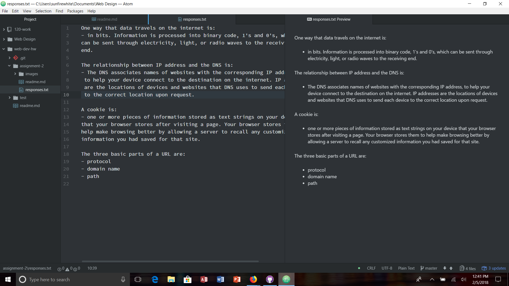

# Assignment 2

A Version Control System allows the developer to make changes again and again by saving the changes, offering a description for the changes, showing when those changes occured, and allowing the developer to make new changes or go back to old changes. If they make changes that don't work, they can easily go back to a previous version of the file. It also allows for collaboration and sharing of files. All parties involved can see the changes that have been made and manage the file if errors occur. We are using a Version Control System, such as Github, because it allows us to do all of the things mentioned above. Github is an easy website that allows developers to share their ideas with the world, in a place where they can get help from others if needed.

[Link to my Resources](./responses.txt)

For this week's assignment, it was good to get a feel for github again. I liked how the tutorial was step by step and gave clear instructions for what to do in order to get github and atom working together. I didn't really have any problems this week so that was nice. I put up a question on the issues page about my directories and was given some good feedback so that was good. I won't be changing anything inside of atom because everything seems to be working fine and I don't want to mess anything up. I've been reading people's problems on the issue board, but haven't been able to help them because I really don't know what I'm doing, and so if I haven't had that problem before, I don't have a clear solution. Overall, I would say that this week I learned some information about github again that I had forgotten since last semester in coding so this was a good refresher week.

