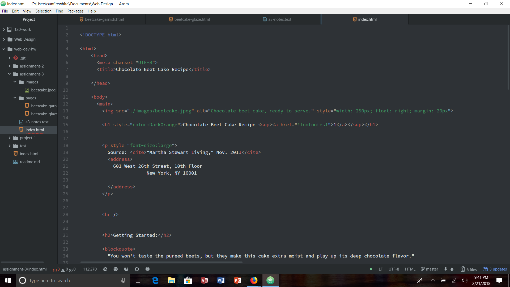

# Assignment 3

On a page, you can have one <head> and one <body> element. These elements are different because they contain different things that help bring the page together. The <head> element contains information about the page. The <title> element is usually contained within the <head> element. The <body> element contains information that will be displayed in the main browser window for everyone to see.

Structural Markup tells you the information about the structure of a document. It includes elements like headings, paragraphs, breaks, and lists. These elements help visually guide and provide information about the content in the document. Semantic markup is used to reinforce the meaning of the information in the document by providing citations, quotations, definitions, show editorial changes, or help emphasize a word. Each markup is used for the different parts of the document. One is for the big parts such as headings, while the other deals with all of the information provided in the document.

For this assignment I followed the directions very carefully to make sure that I didn't miss any steps. I first read all of the information provided on the website, which really helped me get a feel for what HTML can do. Most of the tags that were presented seems super easy to understand so that was very nice for this assignment. Before I uploaded it to github, I went back and made sure I did all of the steps to make sure I didn't miss anything. After I got everything uploaded to github, I tried all of the links to see if they worked. I only had one problem, which was the email link, so I had to come back to my index.html file to fix the email link. Otherwise, I had a good time doing this assignment.

Just from reading this weeks readings, I learned a lot more than I did before. It was interesting to read all of the information about the different tags and how they can be used. I had no idea how you could make a website work with code, but I made it happen which I'm really proud of.

I'm sad to say that I wasn't able to help any of my classmates with issues this week. I really want to be the kind of coder who can help others if they're having issues. I put up an issue, but it got solved right away. It wasn't really an issue, just more of a question.

