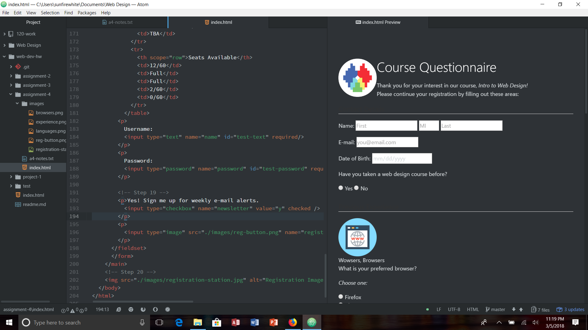

# Assignment-4

Alt text is text to help those who are visually impaired. When you have an image on the screen, alt text helps to identify the picture so that those who can't see the image, know what the image is about. If it is necessary to understand the context of the page, it helps to make the description very detailed.

I think I've come across most of the forms that we've talked about this week. But mostly just we forms such as drop down boxes, text entry, password input, file uploads, etc. Each has a different purpose, but they all come together to help make the website run smoothly for whatever job it has to do, whether that's finding information, or loging someone into their site, or saving informtion for someone's purchases.

For this weeks assignment, I followed all of the directions very carefully. Sometimes I didn't understand what was being asked of me so I went and inspected other people's pages to see if I was doing it correctly, which I was. So I need to stop doughting whether or not I actually know what I'm doing. I didn't really have any problems, which was nice. I'm glad to not be having problems so far, but it could always happen so I'm ready to handle them if I need to. I feel like this weeks information gave me a lot of insight into what goes into a website, so I don't feel like I need to discuss anything further because I got most of the knowledge about how things work from the website. Everything worked out for me, and I had no issues that I needed to report to the issues board. However, I'm not sure if I helped anyone this week on the issues board. I know that I wanted to, but I don't remember if I actually went in and talked to someone. This week has been crazy for me, so I honestly don't remember if I did or not. Most likely not, but I wish I did.

Overall, this week was fun. It was cool to learn what all goes into the selection types, and text types, because I've always wanted to know how people make websites have those things in them.

