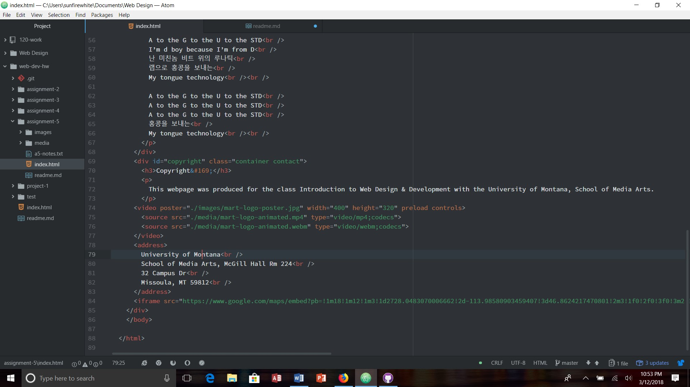

# Assignment-5

For every element, you need to have certain attributes. Id's are a unique identifier given to an element, so that it is different from every other Id, and is a good identifier. Classes are identifiers, and it groups similar types of elements together. This is good for easy styling of the elements. Div's are block-level elements that group other elements together. They are good for creating structural clarity and identifying element groups. Spans live within divs, and group content together that requires organization or extra styling.

It might be beneficial to consider third-party media over self-hosted media because when you self-host media to a site, it can take up a lot of bandwidth depending on the size of the movie file, and because of that, many web hosting companies charge extra for the use of the bandwidth. If you go with a third-party, they can provide you with options to solve the problem of a large movie file size. You can upload high-quality versions of your media, and they will handle the compatability, encoding, and other necessary details for media to play on browsers.

For this week's assignment, I paid very close attention to what the instructions told me to do. This was really fun to make because I get to pick an artist that I enjoy and make a website about one of their songs. By going through the directions carefully, I was able to not have any issues arise which was nice. I've been thinking about coding lately, and was curious if other web designers and coders in other countries have coding languages in their language, or if everyone uses English as the univeral coding language? I feel like it would be difficult to code in a different language other than your own. This week was also another crazy one for me because I had tests, so I wasn't able to answer anyone's questions on the issue board. I really want to be an active participant on the issues board, because I want to help others with their issues in coding. Overall though, this week was really cool, and I like being able to look at the other people's work and see what music they like.

