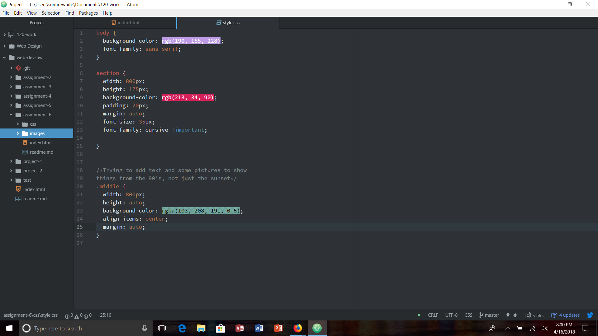

# Assignment-6

For this assignment, I didn't really have a design in mind. I kind of just went with what I could make work. I looked up the 90's and the designs and colors and tried to incorporate the colors from what I found. I used the sunset picture because I thought it would go with my color scheme. I don't know why, but as I was reading through the information learning about CSS, it was a lot easier than actually doing it. I got frustrated a lot because nothing would work the way I wanted it to. I even kept going back to the web design website to help with my site, but nothing was working.

I chose to use these 3 colors in my site. I wanted to make it look authentic by using colors that I thought were close to what I found. The ones I used were rgb(190, 155, 228), rgb(213, 34, 90), and rgba(103, 208, 191, 0.5). For the last one, I put a 50% opacity on it which I thought was cool.

As the semester is winding down, I seem to be busier and busier each week with homework, and feel that I'm not putting enough effort into this class. After my anthropology test this week, I will be able to spend more time learning and understanding CSS better. I didn't post anything on the issues board, nor did I help anyone. Doesn't seem like people really need help anymore unless it's something really complicated which I probably can't help with. I don't think I need to look at anything from this week more in depth, I think I just need to review it again so that I know how to do everything. I was having problems putting my graphic where I wanted on the screen. I couldn't get it to move to any part of the screen, so I just left it where the code put it.

