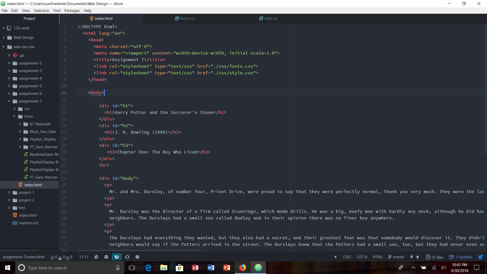

# Assignment 7

For my design process, I just wanted to choose fonts that looked cool, and would kind of fit the Harry Potter vibe. I used BlackHanSans, PlayfairDisplay regular and bold, and PT_Sans-Narrow. For the fall back I used one called Do Hyeon. I really liked all of them and thought that they worked well together for the theme.

A system font is a font utilized by the operating system for displaying text used in menus, icons, errors, etc. A webfont is a specially tuned font for the use on websites using CSS @font-face declaration. Web safe fonts are those that are pre-installed by many operating systems.
The importance of having a fallback font is incase the font you choose to use in your website isn't compatible with all operating systems, then the fallback font you choose will be used instead of the first.

For this weeks assignment, I paid close attention to the website. It was actually really fun to do typography and learn about the different ways to add typography to a website. I didn't really have any problems this week. It was alot easier this week than it was last week. I think typography has been the most fun part of making websites so far. I don't think there's anything I want to know about further. I was pretty pleased with this week's assignment. I didn't post on the issues board, but I probably will because I have a question about the color scheme in atom. It changed for me and so different words changed to different colors, or words that would have color don't anymore so I'm confused about that. Other than that everything seems good!

