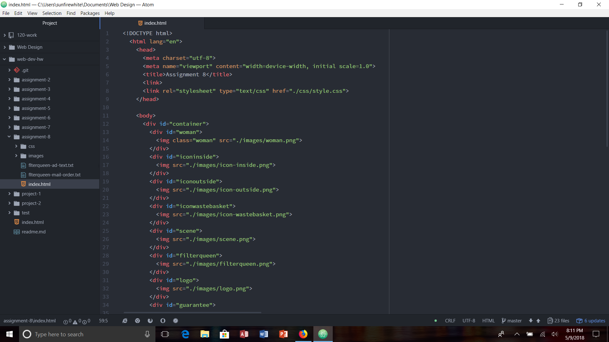

# Assignment 8

The difference between padding, margins, and borders is that the border is the box around your content, while padding is the amount of space between the content and the border. The margin is the amount of space from the border to the edge of the parent element, or other elements.

I feel like the hardest task to accomplish in this assignment was creating the layout. I was having trouble with making the images go to the places I want it to. Fonts were not good. I don't know if I was doing something wrong with them, but no matter what I did, it wouldn't do the fonts that I wanted. I followed the same steps as the last assignment, but nothing was working for me!

I feel that for this assignment, I followed the directions clearly. I had some issues including fonts, and creating the layout. I solved them by rereading the information on the website, and looking up ways to solve my problems! I really enjoyed learning about margins, padding, and borders. It was also really cool to understand how dropdown menus work with code because I never really understood that before. I didn't post any issues to the issues board, but I was able to talk to other people about their issues with grades and this assignment.

