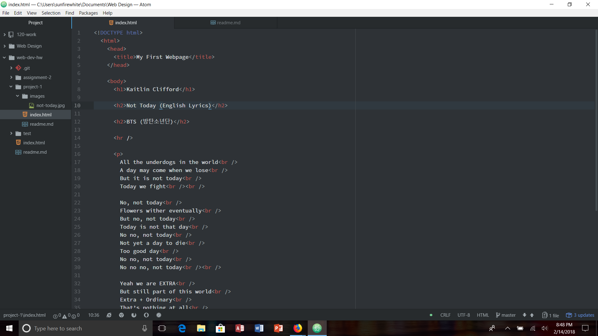

# Project-1

The browsers I use the most are Firefox, and Safari on my iphone. I used to use Internet Explorer when I was younger, but it has become so
much slower than it was, so I switched to Firefox since that's what worked best at my highschool and at my house.

A browser functions by sending a request over the network to a server. It then returns a collection of web content. The browser interprets the content given to it, and then displays the web page. In browsers we have the user interface, rendering engine, and browser engine all working together to make up the page from the network to display to you.

For me, the Wayback Machine was confusing to use. At first everytime I would put in a website and click on a date, it would take me to an error page. But I did manage to make it work. I looked at Youtube, and it has certainly changed over the years. It was more plain than it is now, but still useful.

For this assignment I followed all of the steps from the tutorial and read all of the material to make sure I had a grasp on how to create the web page. I viewed some students pages, but they looked totally different than mine because they all added "Hello World!" which threw me off a bit so I don't know if those are old pages, or if those are from now and I missed something big time. I didn't seem to have any problems this time, not that they couldn't happen in the future. It seemed that a lot of people had troubles with their photo this time around. I know that I had trouble with a photo one time, and it was because it wasn't placed properly inside my folder. I didn't help my classmates with the problems though because A, either I was too late to help with their problems and someone answered it, or B, I had no idea how to help them and didn't want to mess it up for them. The only things I would like discussed further are the different tags that can be used throughout a document. I have trouble remembering all of them, and if I'm typing them out correctly, so I would like to know if there's a cheat sheet for them or not.

