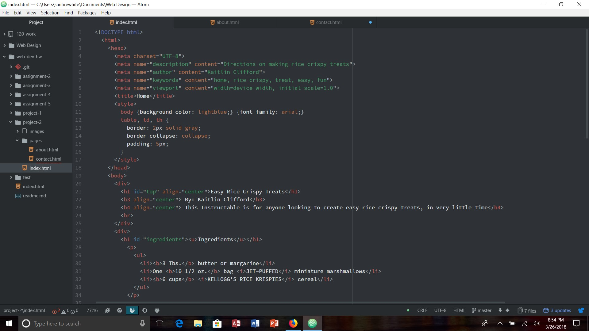

# Project-2

I felt like starting to learn HTML was hard. Since I had done some coding before, it wasn't extremely hard, but still difficult. Overall though, I'm having fun learning how to make websites, and seeing my coding come to life on the screen. I can go tell all of my friends and family now that I can make websites!

I feel like learning CSS will be even more difficult than HTML. In my head, it looks like there could be sooooo much more that has to go into stying a website than I think, so I'm a little afraid for that. It will be nice to learn how I can make my websites look unique and not plain arial type.

For this assignment, I paid attention to directions very carefully. I did bounce back and forth from some steps because I wasn't sure how to do them. But I got them after a bit, so no worries. I didn't really have any problems. If I did, I was able to quickly realize what my mistake was, and fix it. I'm nervous but excited to start learning CSS because that can give assignments like this and extra boost in order to look super fancy. And I personally didn't put anything on the issues board that I couldn't solve myself. I did think that this assignment opened earlier than it did so I was freaking out when it wasn't open for me. But then I read stuff on the website and realized my mistake. Overall, this assignment was super cool, even if I had to do everything by myself which I wasn't yet prepared for. But it gave me the confidence to do it again because I know I can do it.

